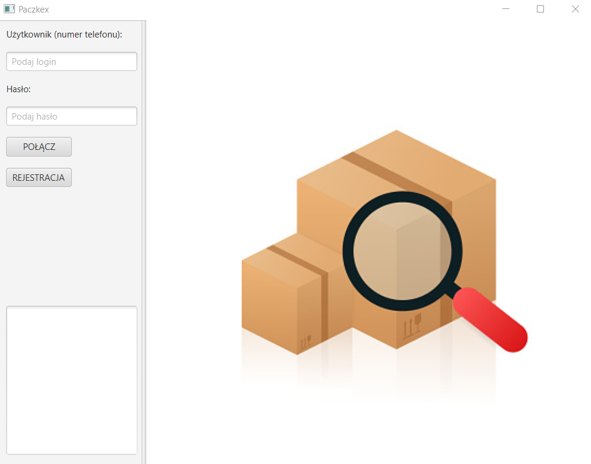

# Paczkex
Desktop app used for simulating a system of package delivery.
Technologies used: Java, JDBC, MySQL
## Functionality
- Login system with password encryption

- User view used for sending, receinving and viewing packages

